### 금융 상품 비교 애플리케이션
# 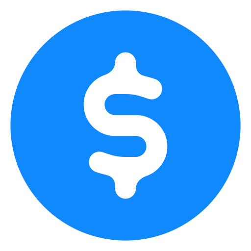 MYFI

### 목차
1. [팀원 정보 및 업무 분담 내역](#🙋‍♀️-팀원-정보-및-업무-분담-내역)
2. [설계 내용 (아키텍처 등) 및 실제 구현 정도](#📊-설계-내용-아키텍처-등-및-실제-구현-정도)
3. [데이터베이스 모델링(ERD)](#📑-데이터베이스-모델링erd)
4. [금융 상품 추천 알고리즘에 대한 기술적 설명](#🧑🏻‍💻-금융-상품-추천-알고리즘에-대한-기술적-설명)
5. [서비스 대표 기능들에 대한 설명](#💁‍♀️-서비스-대표-기능들에-대한-설명)
6. [느낀 점, 후기 등](#🙇‍♀️-느낀-점-후기-등)

## 🙋‍♀️ 팀원 정보 및 업무 분담 내역
- 프로젝트 기간 : 2023/11/16 ~ 2023/11/24 (약 9일)

|이름|역할 및 구현 기능|
|---|---|
|나해란 (팀장) |Front End - figma, 회원가입, 로그인, 마이페이지, 홈, 금융 상품 비교, 환율 계산기, 주변 은행 검색, 게시판 CRUD, 상품 관리, 상품 추천 Back End- 유저 프로필 수정 기능, 금융 상품 정보 저장 |
|송찬의|Back End - ERD, 회원 커스터마이징, 환율 정보 저장 및 업데이트, 금융 상품 정렬 및 필터링, 금융 상품 회원 저장, 게시판 CRUD, 추천 알고리즘 1, 2 |

## 📊 설계 내용 (아키텍처 등) 및 실제 구현 정도
### 🖥 기술 스택
**🌕 front**

- language
    - javascript
- framework
    - Vue3
    - pinia (+pinia-plugin-persistedstate)
    - vuetify
    - axios
    - chart.js

**🌑 back**

- language
    - python
- framework
    - django
    - django-rest-framework
    - dj-rest-auth
    - pillow
    - drf-spectacular

### 🎨 Figma
[**🔗 Figma Link**](https://www.figma.com/file/WtDHevKc33jSFLmI5opbAW/%EA%B4%80%ED%86%B5-%ED%94%84%EB%A1%9C%EC%A0%9D%ED%8A%B8?type=design&node-id=0%3A1&mode=design&t=WsRWFXL4u6F4lILB-1)
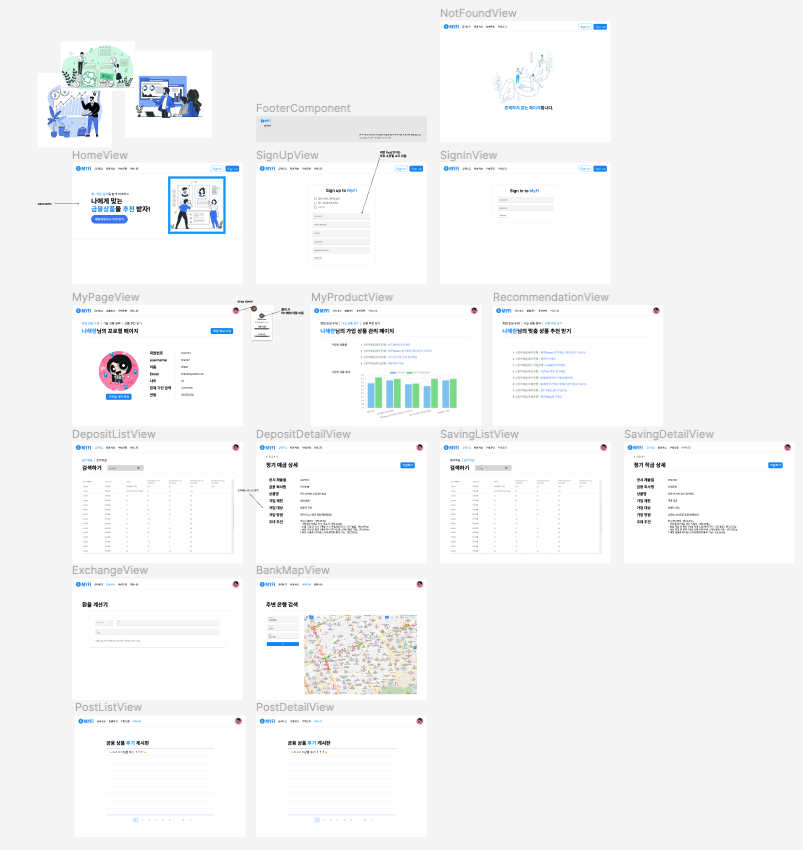

- 예, 적금 금리 비교, 환율 계산, 집 주변 은행 검색, 상품 추천, 게시판 등의 필수 기능 뿐만아니라, 집 주변 은행 검색 시 해당 은행의 상품 카드 출력, 프로필 이미지, 네이버 환율 그래프 카드 및 redirect, 회원가입 & 로그인 유효성 검사, 금융 상품 이자율 시각화, 404 Not Found 페이지까지 계획했던 기능을 모두 구현함.

## 📑 데이터베이스 모델링(ERD)
[**🔗 ERD drawio Link**](https://drive.google.com/file/d/1DKVab0B_zfNrMHybdNuF31o8LawDn5PA/view?usp=sharing)
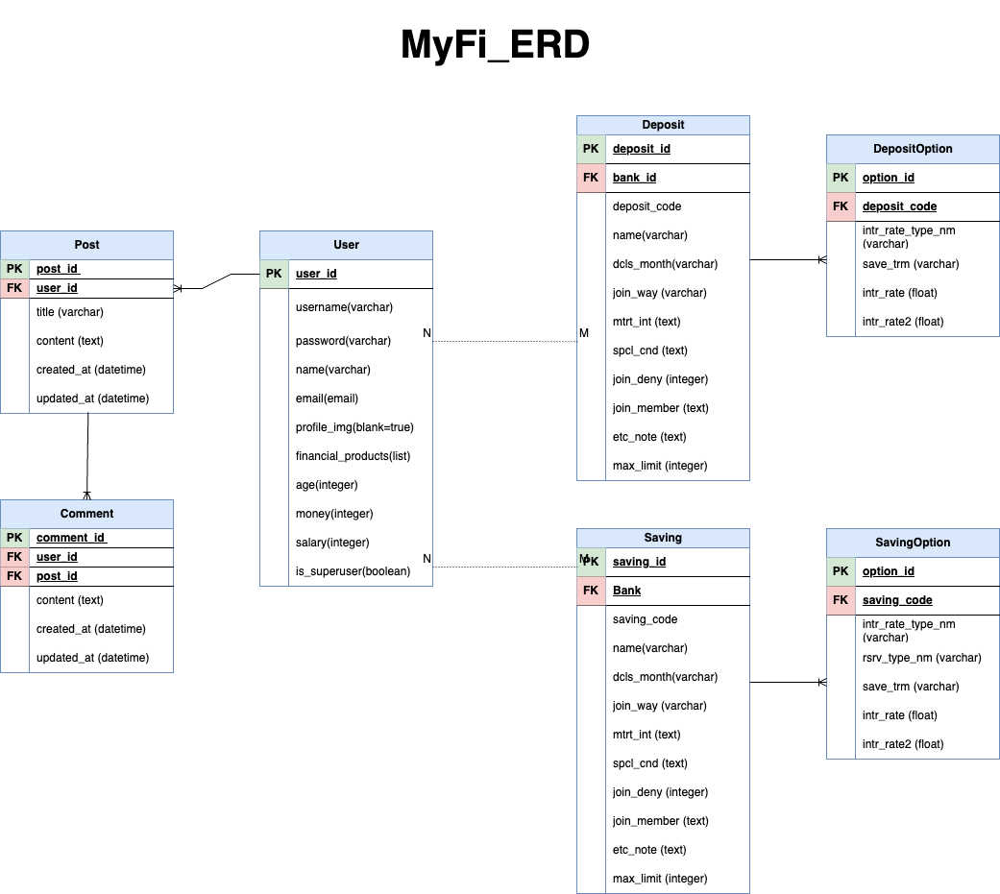

### 🗂️ API 명세서
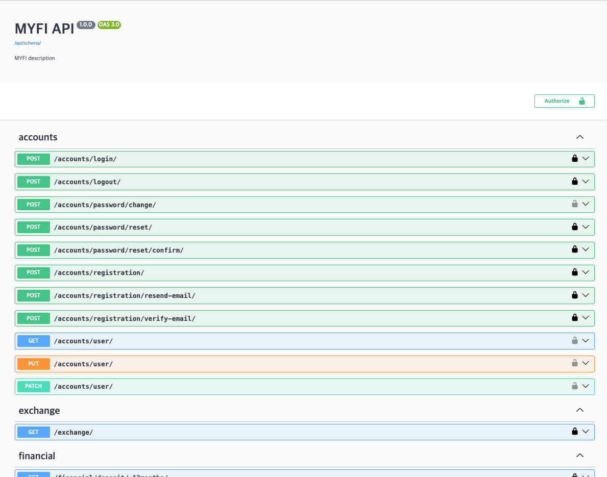

## 🧑🏻‍💻 금융 상품 추천 알고리즘에 대한 기술적 설명
### 추천 알고리즘 1️⃣.
**5000명의 유저 더미데이터**를 생성하여 나와 나이, 자산, 연봉이 비슷한 유저가 많이 가입한 상품을 추천해주는 알고리즘입니다.

여기서 나와 비슷한 유저란? 나이 ± 6살, 자산 ± 1,000,000원, 연봉 ± 1,000,000원을 만족하는 유저를 의미합니다.

만약, 비슷한 유저가 없을 시, 전체 유저가 많이 가입한 금융 상품 top20을 추천해줍니다.

### 추천 알고리즘 2️⃣.
유저에게 예, 적금 희망 금액, 희망 기간을 받습니다.

희망 금액의 경우 그보다 비슷하거나 큰 최고 한도를 가진 금융상품 & 희망 기간의 경우 그 예치 기간을 가진 금융상품을 필터링하여 두 경우를 모두 만족하는 금융 상품 중 이자율이 높은 top20 금융 상품을 추천합니다.

## 💁‍♀️ 서비스 대표 기능들에 대한 설명

### 1️⃣ 메인 페이지
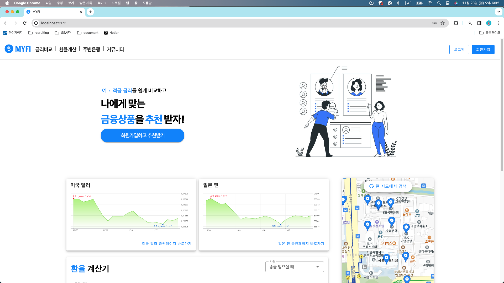

- carousel로 메인 페이지를 꾸미고, 환율 계산기와 미니은행검색 지도로 MYFI의 서비스를 맛볼 수 있게 하였습니다.

### 2️⃣ 로그인, 회원가입 페이지

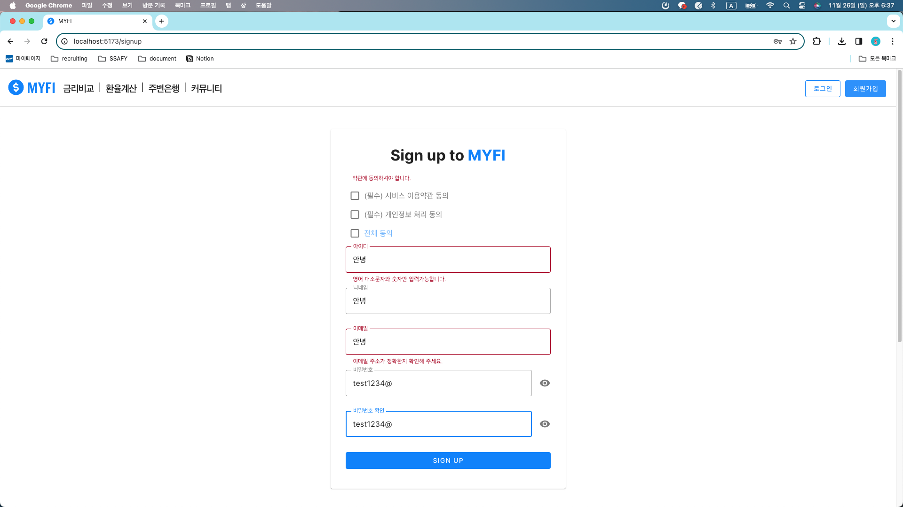

- 로그인 실패 시 에러메세지를 띄워 사용자로 하여금 아이디와 비밀번호를 다시 확인할 수 있오록 하였습니다.
- 회원가입에서 약관동의, 아이디는 영어 대소문자와 숫자만 이루어진 5글자 이상으로, 이메일은 이메일 형식으로, 비밀번호는 8~16자의 영어 대소문자, 숫자, 특수문자로 이루어져 있는지 확인하는 등의 꼼꼼한 유효성 검사를 진행하였습니다.

### 3️⃣ 마이페이지
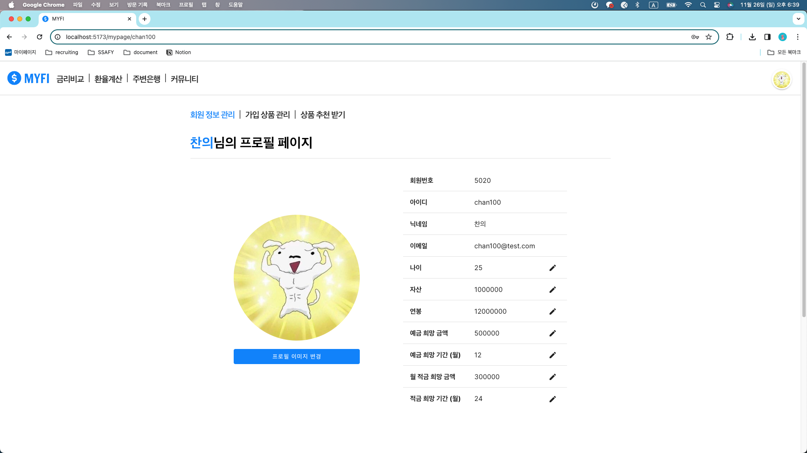
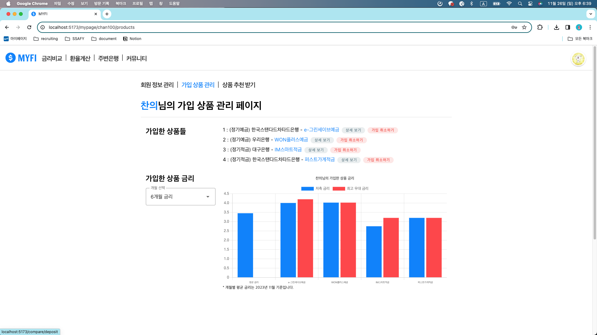
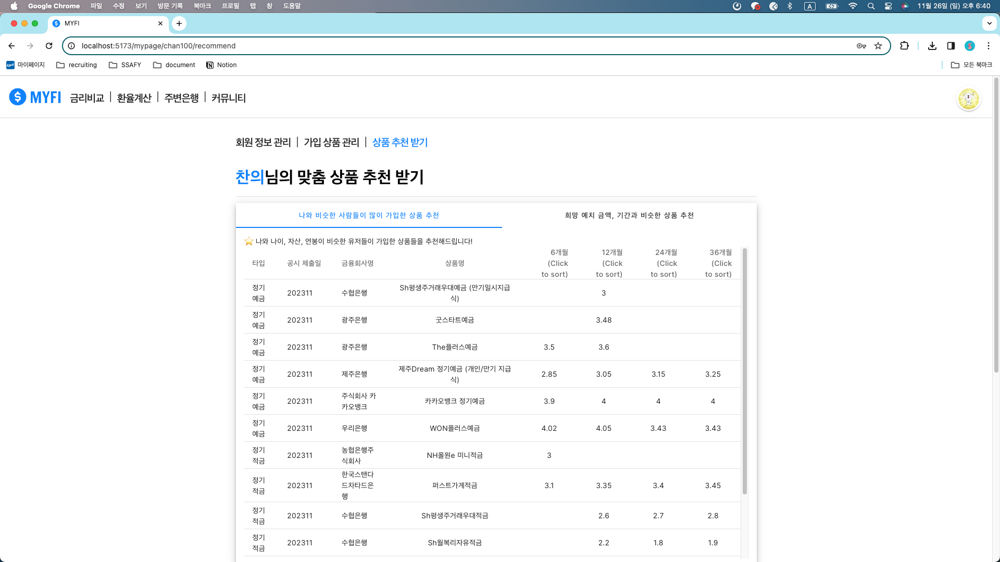
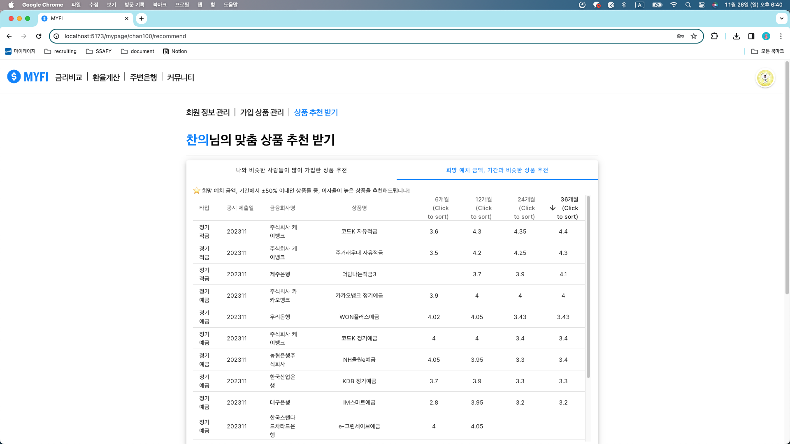

- 마이페이지에서 프로필이미지, 나이, 자산, 연봉 등의 회원 정보를 확인하고 수정할 수 있습니다.
- 가입 상품 관리 탭에서는 기존에 가입했던 상품들의 리스트를 확인하고 상품들의 상세 정보와 가입 해지 등을 할 수 있습니다. 또한, 가입한 상품들의 이자율을 6, 12, 24, 36 개월 별로 시각화하여 이자율을 한 눈에 비교할 수 있습니다.
- 상품 추천 탭에서는 위에 기술한 알고리즘1, 2에 대한 결과를 테이블로 확인할 수 있습니다. 이는 각각의 이자율로 정렬할 수 있고 클릭하여 상세 정보를 확인한 후 바로 가입까지 진행할 수 있습니다. 

### 4️⃣ 금융 상품 비교 페이지
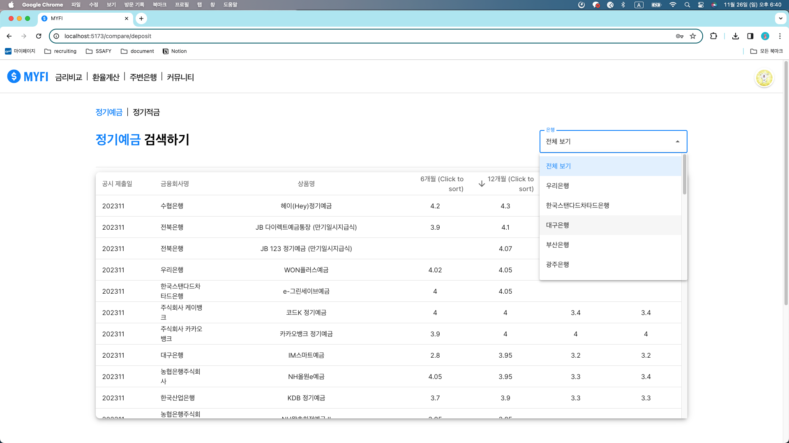
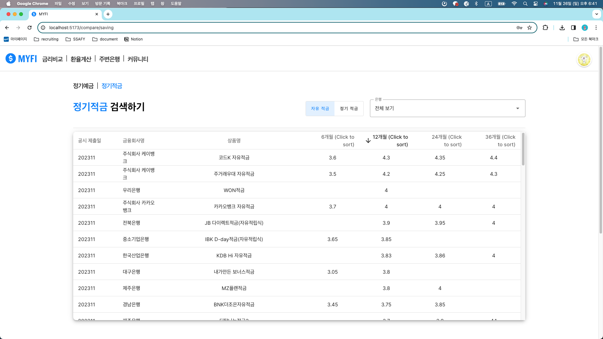
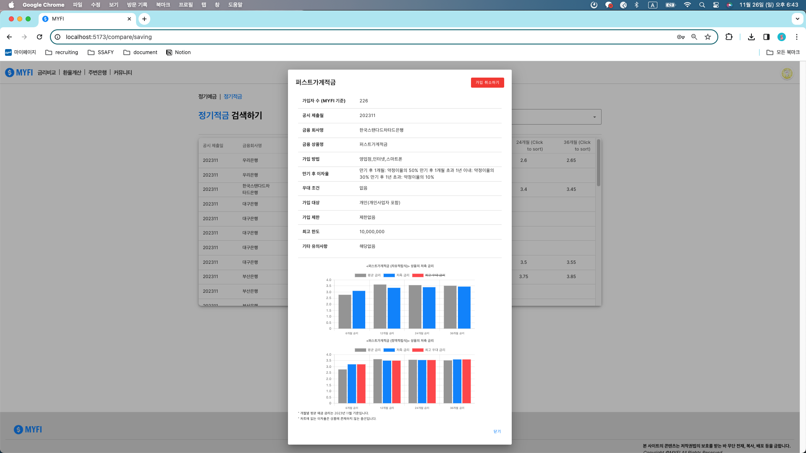

- 금융 상품 비교 페이지에서는 정기 예금 페이지, 정기 적금 페이지의 두 개의 탭으로 나누어집니다.
- 정기 예금 페이지에서는 모든 정기 예금에 대한 정보를 테이블에서 확인할 수 있고 각각의 이자율에 따라 오름차순, 내림차순 정렬이 가능하며 특정 은행에 대한 필터링도 가능합니다.
- 정기 적금 페이지 또한 예금페이지에서 가능했던 모든 기능이 가능하며, 적금은 자유적금, 정기적금으로 나누어지기 때문에 토글버튼으로 자유인지, 정기인지 선택이 가능합니다.
- 또한 클릭하여 금융 상품에 대한 상세정보를 보고 바로 가입 또는 가입해지를 진행할 수 있습니다. chart는 legend를 클릭하여 원하는 legend의 bar chart만 볼 수도 있습니다.

### 5️⃣ 환율 계산 페이지
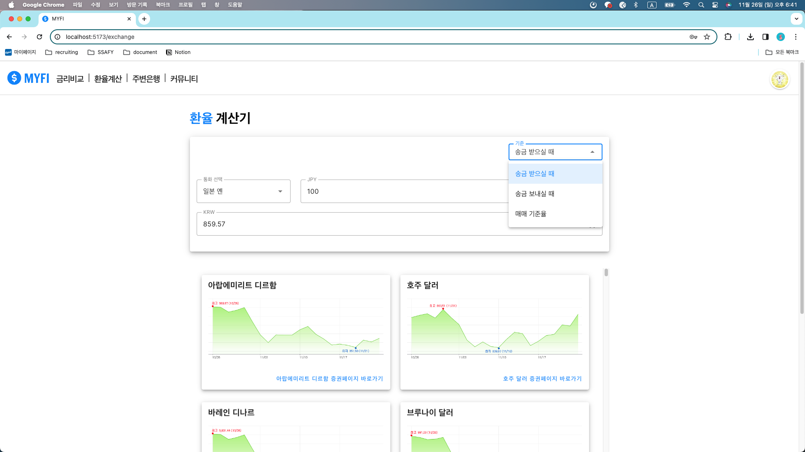

- 환율 계산 페이지에서는 송금 받으실 때, 송금 보내실 때, 매매 기준율의 세가지 기준으로 여러 나라의 통화로 환율 계산을 할 수 있습니다.
- 또한 하단에 네이버의 환율 그래프로 각각 통화의 1개월간 추이가 어떠했는지 한 눈에 확인이 가능하고 바로 해당 네이버 환율 페이지로 이동도 가능합니다.

### 6️⃣ 주변 은행 검색 페이지
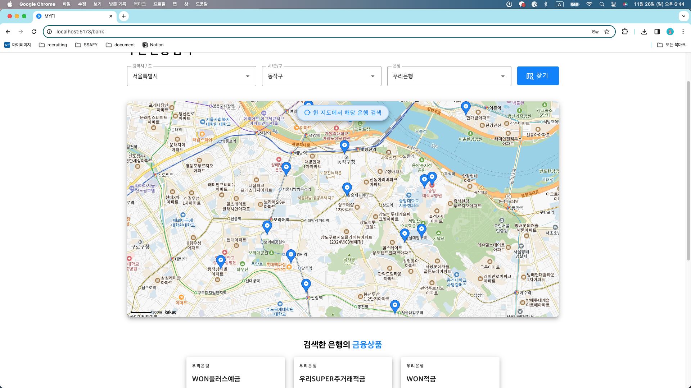
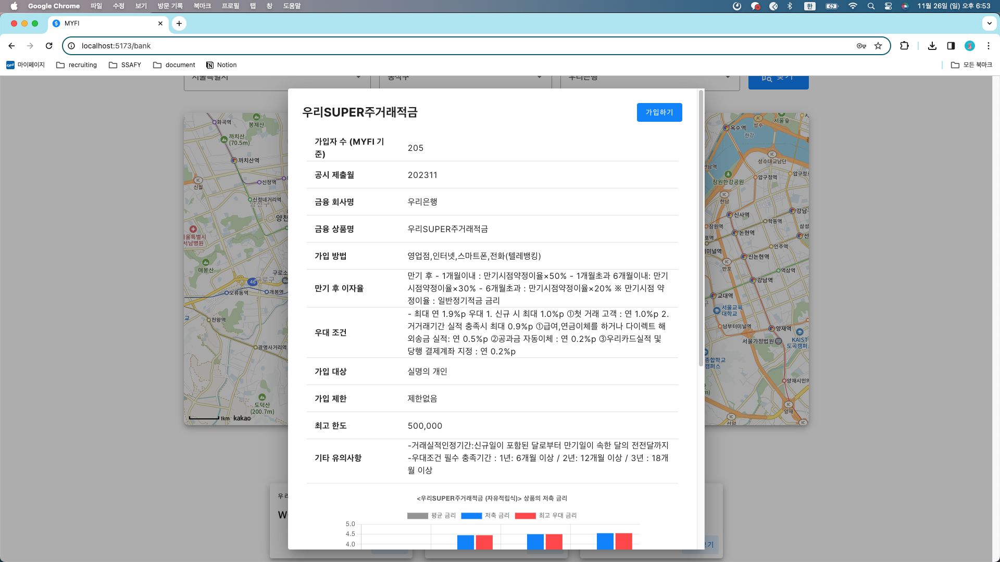

- 주변 은행 검색 페이지에서는 직접 광역시/도, 시/군/구를 선택하여 장소를 지정할 수도 있고, 현재 지도 위치에서 새로 검색도 가능합니다.
- 전체 은행 뿐만아니라, 특정은행의 위치도 검색이 가능한데, 특정 은행 검색 시, 해당은행의 금융 상품을 하단에 카드로 띄워 어떤 상품이 있는지 한 눈에 확인이 가능합니다. 물롴 클릭하면 해당 상품의 상세 정보를 모달 창으로 볼 수 있습니다.

### 6️⃣ 금융 상품 자유 게시판
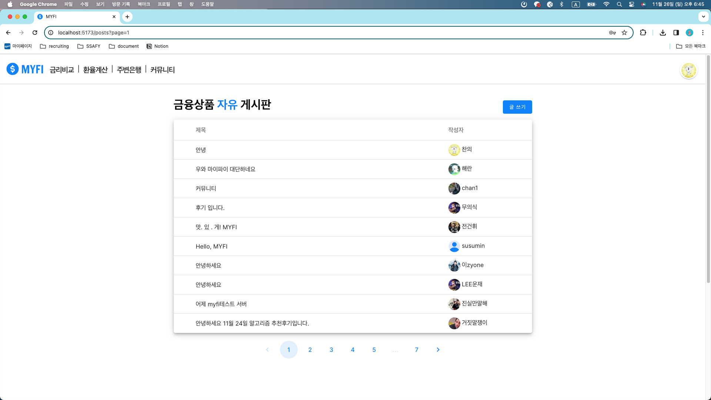
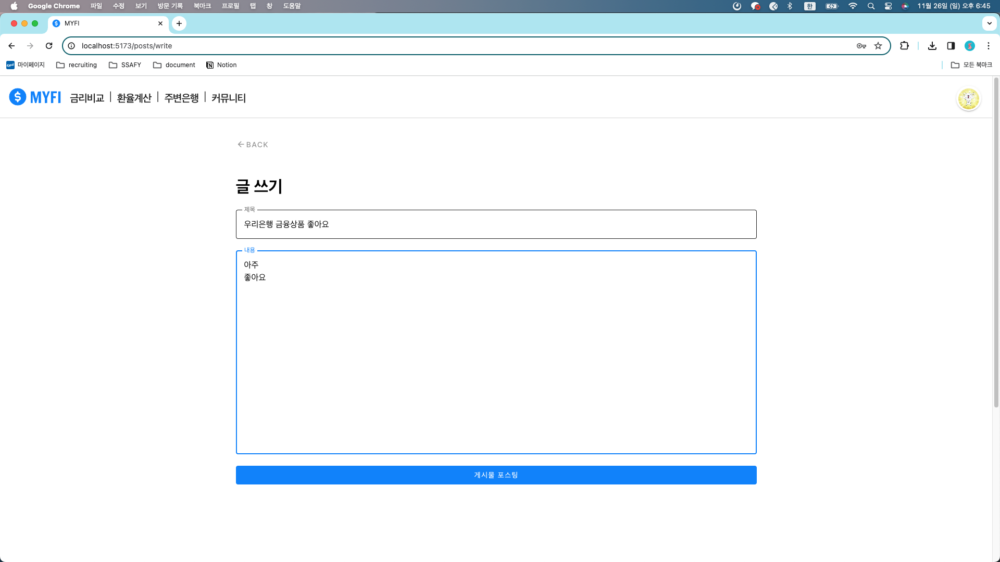
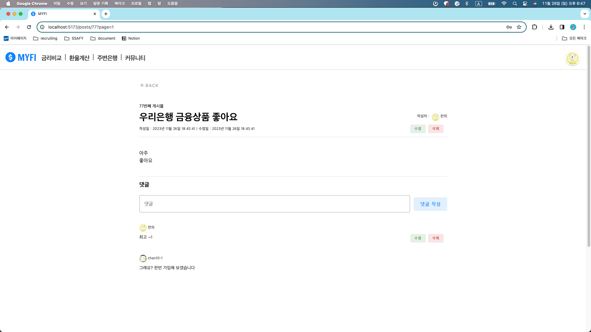
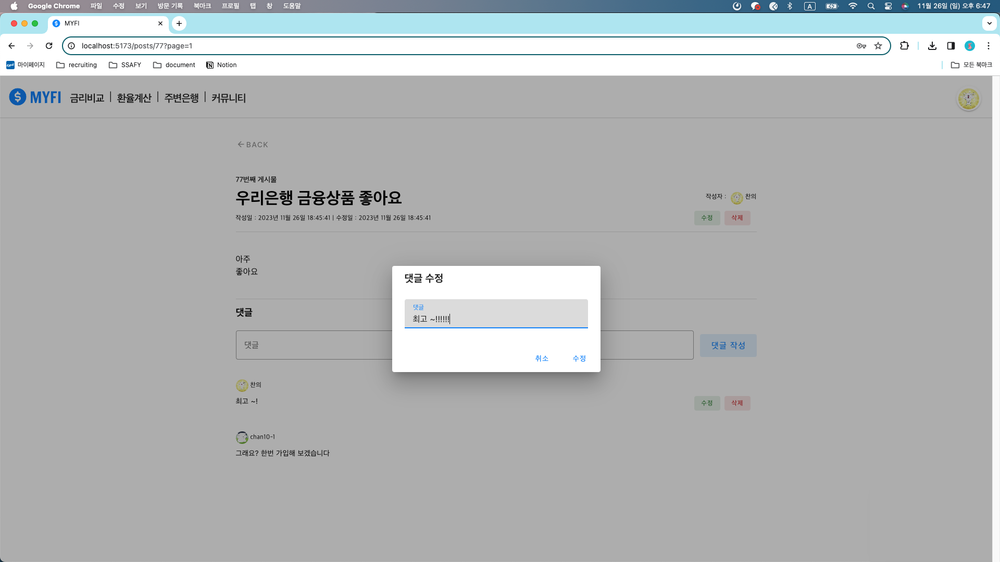
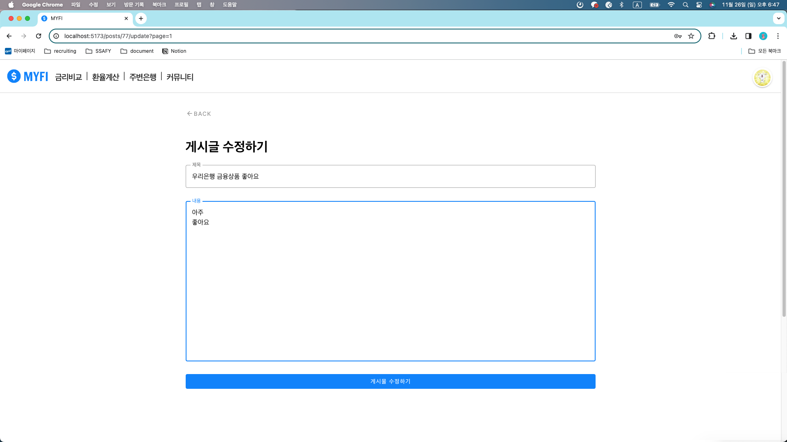
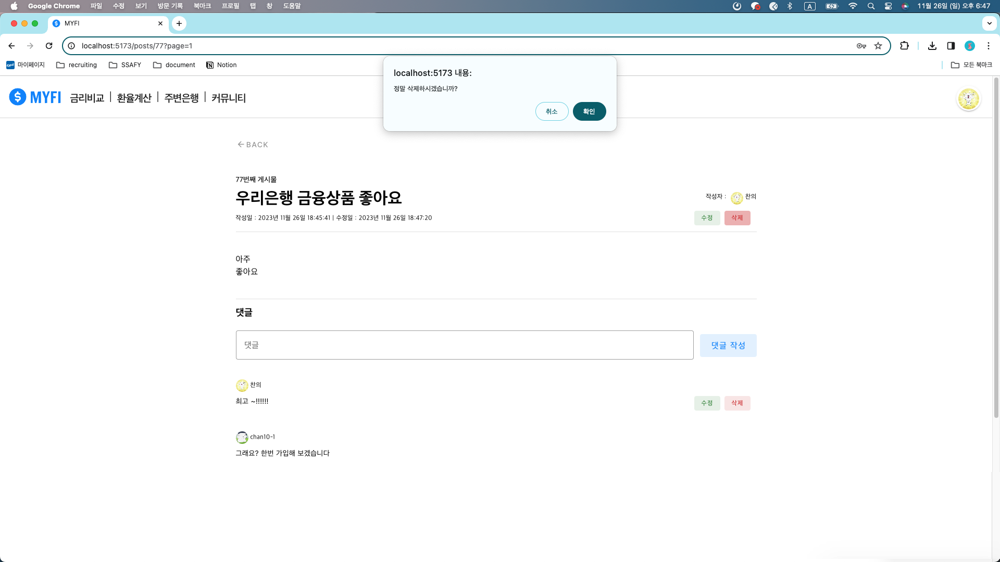

- 인증된 사용자들(로그인 된) 사용자들끼리 커뮤니티를 형성할 수 있도록 금융 상품 자유 게시판을 제공합니다. (비로그인 회원은 조회만 가능합니다.)
- 기본적인 게시물 CRUD와 댓글 CRUD를 제공합니다.
- 또한 게시물을 10개씩 페이지네이션하여 사용자로 하여금 편한 UI를 제공합니다.

### 7️⃣ 404 Not Found 페이지
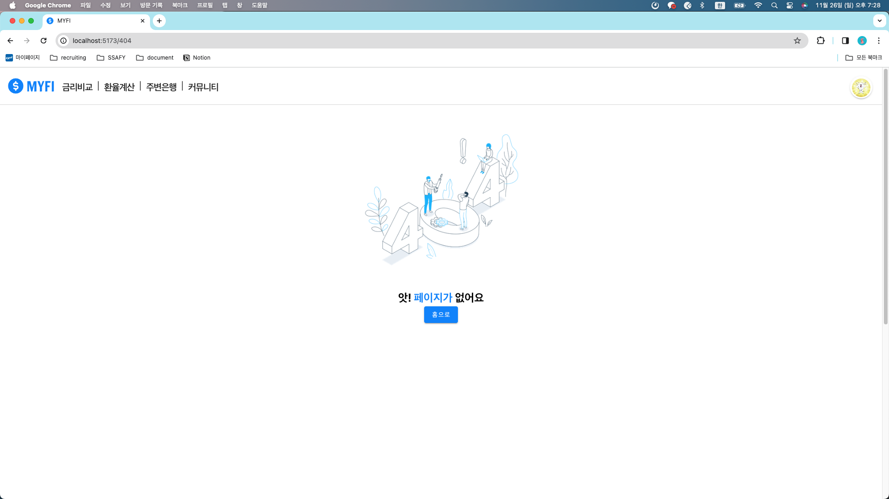

- 사용자가 잘못된 url로 이동할 때 404페이지로 redirect하여 홈으로 돌아갈 수 있게 안내해줍니다.

## 🙇‍♀️ 느낀 점, 후기 등

* 나해란 : 1학기에 배운 내용을 총 정리 할 수 있었고, 배우지 않았던 내용은 공식문서를 읽어보며 공식 문서 읽는 법과 프로젝트에 대한 전체적인 흐름을 파악할 수 있었던 프로젝트였습니다. 프로젝트 기간이 짧은 편이라 더 많은 기능을 구현하지 못해 아쉽지만, 단 시간에 이정도 해낸만큼, 다음에 조금 더 긴 시간이 주어지면 더 잘 해낼 수 있을 것이라고 확신합니다.

* 송찬의 : 어렵게 생각했으니 어렵지 않았고 쉽게 생각했으나 쉽지 않았습니다.
  배운것이어도 정리가 되어있지 않았고, 많이 부족함을 느꼈었던 것 같습니다. 
  같이하는 팀원에게도 항상 미안한 마음이 들었고 더 잘하고 싶은마음도 동시에 들었던 것 같습니다. 
  2학기에도 많은 시간을 들여 프로젝트를 하게 될 것인데 그때도 이런마음이 들어서는 안되기 때문에
  2학기 시작하기 전까지의 시간을 잘보내야겠다고 다짐하게 되었습니다.